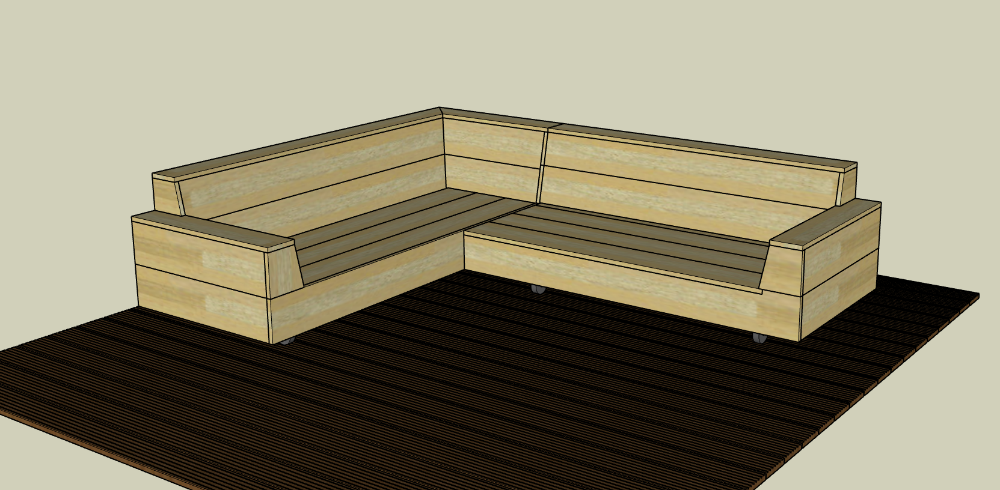
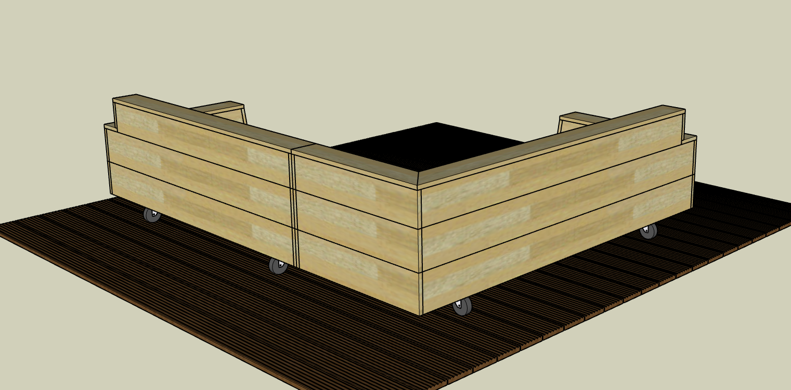
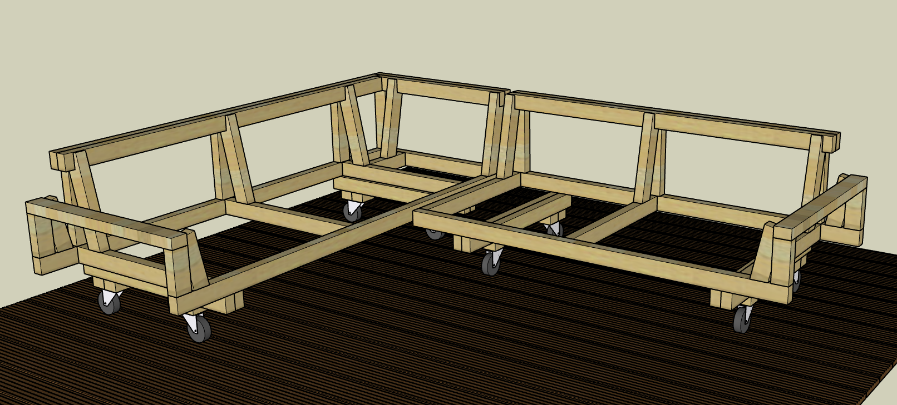
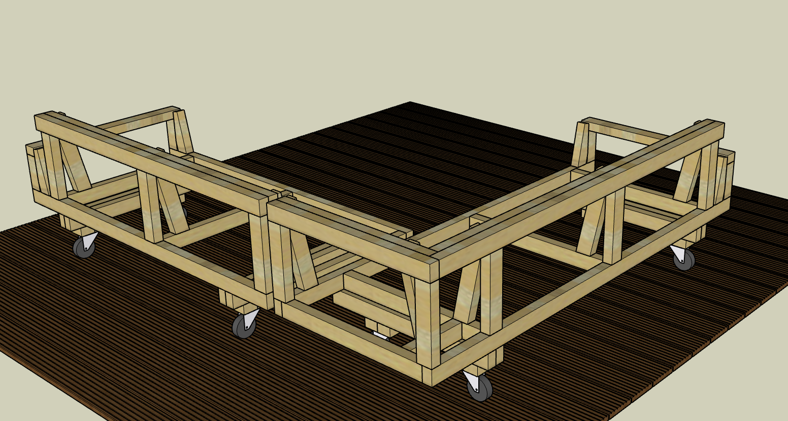
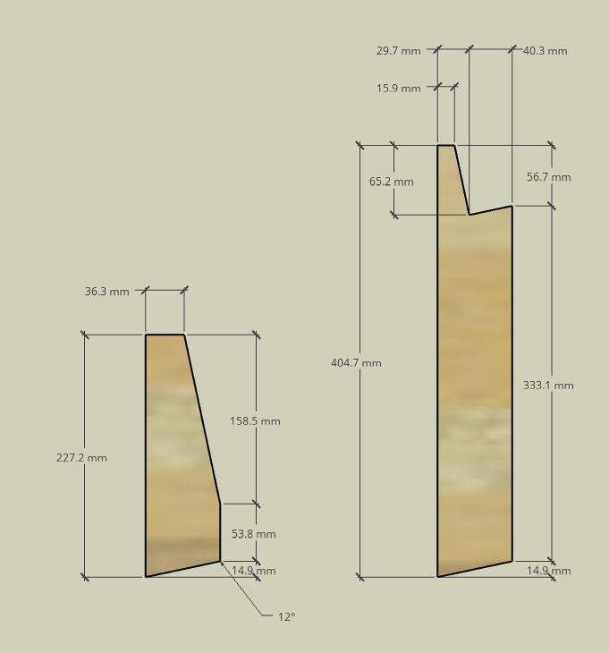
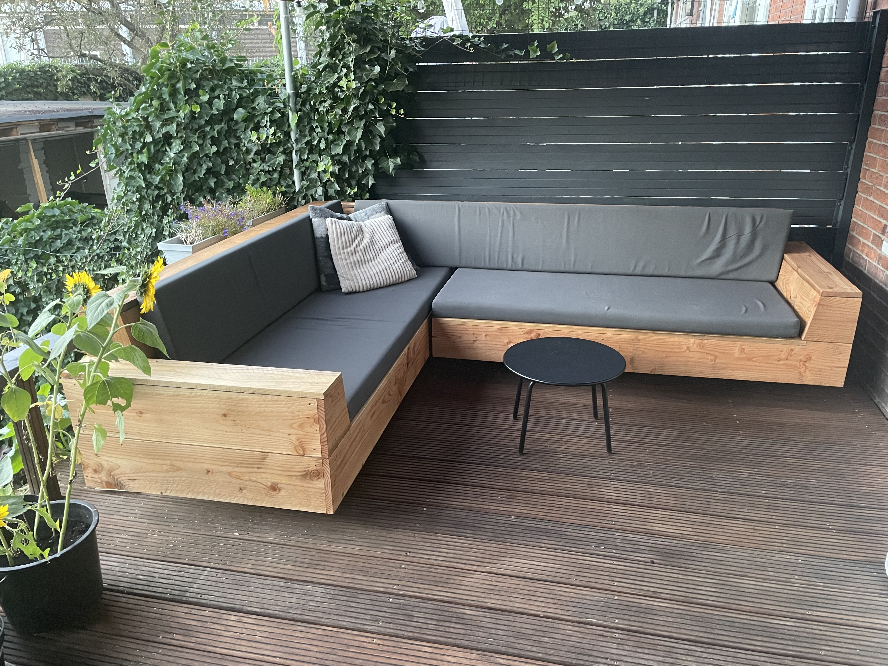

# DIY Outdoor Lounge Sofa Design
DIY design for two wooden outdoor lounge sofas which can be used in a corner setup.
The project contains the following assets:
* [Sketchup](https://sketchup.com) drawing
* Excel sheet containing a list of used materials and costs (Dutch prices in 2021)
* Sawing diagrams, generated with [1D Stock Cutter](http://www.astrokettle.com/pr1dsc.html)

## Dimensions

* Dimensions of sofa A: 2141 mm wide, 870 mm deep, 731 mm high. 
* Dimensions of sofa B: 1792 mm wide, 870 mm deep, 731 mm high.
* Total dimensions for corner setup: 2662 x 2141 mm.
* Seating height: 335 mm (excluding cushions, mine are 70mm high)
* The armrests and backrests are mounted under a 78 degree angle.

The dimensions are not nice round numbers due to the fact that we had a set of cushions already, which we wanted to re-use. I basically designed the sofa around the dimensions of the cushions ;)

## Base Materials
I have used Douglas fir wood for the frames and planks in the following dimensions:
* Beams: 70x45 mm
* Planks: 200x22 mm

All screws are stainless steel:
* 5.0x50 mm (around 100) for constructing the frames
* 4.0x50 mm (around 200) for attaching the planks
* M8x80 mm (16 pieces) wood thread bolts for attaching the wheels

## Screen shots

Detail of armrest and backrest supports:

## Photos of the result

